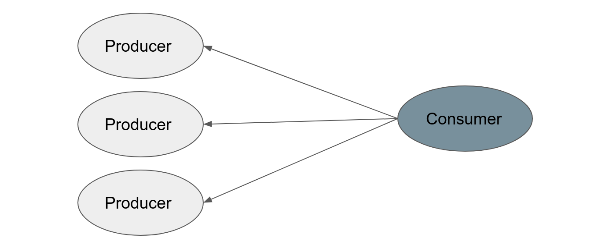

# Launchpad

[](https://badge.fury.io/py/dm-launchpad)

Launchpad is a library that simplifies writing distributed programs by
seamlessly launching them on a variety of different platforms. Switching between
local and distributed execution requires only a flag change.

Launchpad introduces a programming model that represents a distributed system
as a graph data structure (a **Program**) describing the system’s topology.
Each node in the program graph represents a service in the distributed system,
i.e. the fundamental unit of computation that we are interested in running.
As nodes are added to this graph, Launchpad constructs a handle for each of them.
A handle ultimately represents a client to the yet-to-be-constructed service.
A directed edge in the program graph, representing communication between
two services, is created when the handle associated with one node is given
to another at construction time. This edge originates from the receiving node,
indicating that the receiving node will be the one initiating communication.
This process allows Launchpad to define cross-service communication simply
by passing handles to nodes. The open-sourced version of Launchpad currently
provides following types of nodes (you can implement your own types as needed):

*   **PyNode** - a simple node executing provided Python code upon entry.
    It is similar to a main function, but with the distinction that
    each node may be running in separate processes and on different machines.
*   **CourierNode** - it enables cross-node communication. **CourierNodes** can
    communicate by calling public methods on each other either synchronously
    or asynchronously via futures. The underlying remote procedure calls
    are handled transparently by Launchpad.
*   **ReverbNode** - it exposes functionality of Reverb, an easy-to-use data
    storage and transport system primarily used by RL algorithms as
    an experience replay. You can read more about Reverb
    [here](https://github.com/deepmind/reverb).
*   **MultiThreadingColocation** - allows to colocate multiple other nodes in
    a single process.
*   **MultiProcessingColocation** - allows to colocate multiple other nodes as
    sub processes.

Using Launchpad involves implementing nodes and defining the topology of your
distributed program by passing to each node references of the other nodes that
it can communicate with. The core data structure dealing with this is called a
**Launchpad program**, which can then be used for local debugging runs, tests,
distributed executions, etc.

## Table of Contents

-   [Installation](#installation)
-   [Quick Start](#quick-start)
    -   [Implement example nodes](#implement-example-nodes)
    -   [Define the topology](#define-the-topology)
    -   [Launch the program](#launch-the-program)
    -   [Add a test](#add-a-test)

## Installation

Please keep in mind that Launchpad is not hardened for production use, and while we
do our best to keep things in working order, things may break or segfault.

> :warning: Launchpad currently only supports Linux based OSes.

The recommended way to install Launchpad is with `pip`. We also provide
instructions to build from source using the same docker images we use for
releases.

TensorFlow can be installed separately or as part of the `pip` install.
Installing TensorFlow as part of the install ensures compatibility.

```shell
$ pip install dm-launchpad[tensorflow]

# Without Tensorflow install and version dependency check.
$ pip install dm-launchpad
```

### Nightly builds

[](https://badge.fury.io/py/dm-launchpad-nightly)

```shell
$ pip install dm-launchpad-nightly[tensorflow]

# Without Tensorflow install and version dependency check.
$ pip install dm-launchpad-nightly
```

Similarily, [Reverb](https://github.com/deepmind/reverb) can be installed
ensuring compatibility:

```shell
$ pip install dm-launchpad[reverb]
```

### Develop Launchpad inside a docker container

The most convenient way to develop Launchpad is with Docker.
This way you can compile and test Launchpad inside a container without
having to install anything on your host machine, while you can still
use your editor of choice for making code changes.
The steps are as follows.

Checkout Launchpad's source code from GitHub.
```
$ git checkout https://github.com/deepmind/launchpad.git
$ cd launchpad
```

Build the Docker container to be used for compiling and testing Launchpad.
You can specify `tensorflow_pip` parameter to set the version
of Tensorflow to build against. You can also specify which version(s) of Python
container should support. The command below enables support for Python
3.7, 3.8 and 3.9.
```
$ docker build --tag launchpad:devel \
  --build-arg tensorflow_pip=tensorflow==2.3.0 \
  --build-arg python_version="3.7 3.8 3.9" - < docker/build.dockerfile
```

The next step is to enter the built Docker image, binding checked out
Launchpad's sources to /tmp/launchpad within the container.
```
$ docker run --rm --mount "type=bind,src=$PWD,dst=/tmp/launchpad" \
  -it launchpad:devel bash
```

At this point you can build and install Launchpad within the container by
executing:
```
$ /tmp/launchpad/oss_build.sh
```

By default it builds Python 3.8 version, you can change that with `--python`
flag.
```
$ /tmp/launchpad/oss_build.sh --python 3.8
```

To make sure installation was successful and Launchpad works as expected, you
can run some examples provided:
```
$ python3.8 -m launchpad.examples.hello_world.launch
$ python3.8 -m launchpad.examples.consumer_producers.launch --lp_launch_type=local_mp
```

To make changes to Launchpad codebase, edit sources checked out from GitHub
directly on your host machine (outside of the Docker container). All changes are
visible inside the Docker container. To recompile just run the `oss_build.sh`
script again from the Docker container. In order to reduce compilation time of
the consecutive runs, make sure to not exit the Docker container.

## Quick Start

The complete implementation can be found
[here](https://github.com/deepmind/launchpad/tree/master/launchpad/examples/consumer_producers/).

## Implement example nodes

In this producer-consumer example, we have one consumer and multiple producers.
The consumer sends work to the producers, which perform some time-intensive
task before returning the result to the consumer. Finally, the consumer
summarizes the work done by all of the producers.



The producer in this example has just one method which performs some work (for
you to implement) in a given context provided by the caller. Any method of the
class can be exposed for other nodes to call by wrapping a node with a
**CourierNode**. In a typical setup, all nodes live in separate processes or on
distinct machines, while the communication between the nodes is taken care of
transparently by Launchpad. Some care has to be taken though. For
example, the `work()` method may be called from multiple threads within the same
process, so if the producer were to have any shared state then access to it must
be made thread-safe. In this case, the producer is stateless so it is not a
concern.

```python
class Producer:
  def work(self, context):
    return context
```

The consumer defines an initializer and a `run()` method. The initializer takes
a list of handles to the producers (**CourierNode**s).

Any Launchpad **PyClassNode** with a `run()` method will have that method called
automatically upon program entry. Here the `run()` method simply calls `work()`
on each producer and collects the results. At the end, it calls
`launchpad.stop()` to terminate all nodes running within a program.

```python
class Consumer:
  def __init__(self, producers):
    self._producers = producers

  def run(self):
    results = [producer.work(context)
               for context, producer in enumerate(self._producers)]
    logging.info('Results: %s', results)
    lp.stop()
```

In the example above, `work()` methods are called sequentially, so there is no
benefit in running this program distributed. Launchpad, however, allows for
asynchronous calls as well through the use of futures. In the example below
all producers will perform their work in parallel while consumer waits
on all of their results when calling `future.result()`.

```python
class Consumer:
  def __init__(self, producers):
    self._producers = producers

  def run(self):
    futures = [producer.futures.work(context)
               for context, producer in enumerate(self._producers)]
    results = [future.result() for future in futures]
    logging.info('Results: %s', results)
    launchpad.stop()
```

## Define the topology

The next step is to instantiate nodes for the consumer and producers and then
connect them so that the consumer can call methods on the producers. The
connections between nodes define the topology of the distributed program.

Launchpad uses an `lp.Program` class to hold all the nodes. There are several
different types of nodes but here `lp.CourierNode` is used since it is the
simplest type which supports communication between nodes. The parameters to
`lp.CourierNode` are the name of the class and the parameters of its
initializer. Connecting the consumer node to the producer nodes is as simple as
passing in handles to all producers in the initializer of the consumer.
The handles themselves are returned by `lp.Program.add_node()`.


```python
def make_program(num_producers):
  program = lp.Program('consumer_producers')
  with program.group('producer'):
    producers = [
        program.add_node(lp.CourierNode(Producer)) for _ in range(num_producers)
    ]
  node = lp.CourierNode(
      Consumer,
      producers=producers)
  program.add_node(node, label='consumer')
  return program
```

With the above function defining the topology all that remains is to implement
`main()` for Launchpad:

```python
def main(_):
  program = make_program(num_producers=FLAGS.num_producers)
  lp.launch(program)

if __name__ == '__main__':
  app.run(main)
```

## Launch the program

To launch the program (assuming it is called `launch.py`), simply run:

```sh
python3 -m launch --lp_launch_type=local_mp
```

The `--lp_launch_type` controls how the program is launched. In the above case
it is launched locally with each node executed in a separate process.
List of supported execution modes can be found
[here](https://github.com/deepmind/launchpad/tree/master/launchpad/context.py).

## Add a test

Here are some points to keep in mind when creating a test for a Launchpad
program.

*   The easiest way to add a test for your program is to reuse the same topology
    for an integration test (i.e. call `make_program()` from above in
    this example).
*   Launch a test by calling `lp.launch()` just like in `main()` in the above
    example, but explicitly specify `launch_type='test_mt'` (multithreaded
    tests) as a parameter.
*   It is possible to disable automatic execution of a node's `run()` method
    before launching. Do so by calling `disable_run()` on the node in question.
*   In order to call methods to test on a Courier node you will need to
    explicitly dereference the handle of the node first. Do so by calling
    `create_handle()` followed by `dereference()` on the node in question.

Below is an incomplete example illustrating the above concepts. A complete
example can be found [here](https://github.com/deepmind/launchpad/tree/master/launchpad/examples/consumer_producers/launch_test.py).

```python
import launchpad as lp
from launchpad.examples.consumer_producers import launch
from absl.testing import absltest

class LaunchTest(absltest.TestCase):
  def test_consumer(self):
    program = launch.make_program(num_producers=2)
    (consumer_node,) = program.groups['consumer']
    consumer_node.disable_run()
    lp.launch(program, launch_type='test_mt')
    consumer = consumer_node.create_handle().dereference()
    # Perform actual test here by calling methods on `consumer` ...
```

## Citing Launchpad

If you use Launchpad in your work, please cite the accompanying
[technical report](https://arxiv.org/pdf/2106.04516):

```bibtex
@article{yang2021launchpad,
    title={Launchpad: A Programming Model for Distributed Machine Learning
           Research},
    author={Fan Yang and Gabriel Barth-Maron and Piotr Stańczyk and Matthew
            Hoffman and Siqi Liu and Manuel Kroiss and Aedan Pope and Alban
            Rrustemi},
    year={2021},
    journal={arXiv preprint arXiv:2106.04516},
    url={https://arxiv.org/abs/2106.04516},
}
```

## Acknowledgements

We greatly appreciate all the help from [Reverb](https://github.com/deepmind/reverb)
and [TF-Agents](https://github.com/tensorflow/agents) teams in setting
up building and testing setup for Launchpad.
